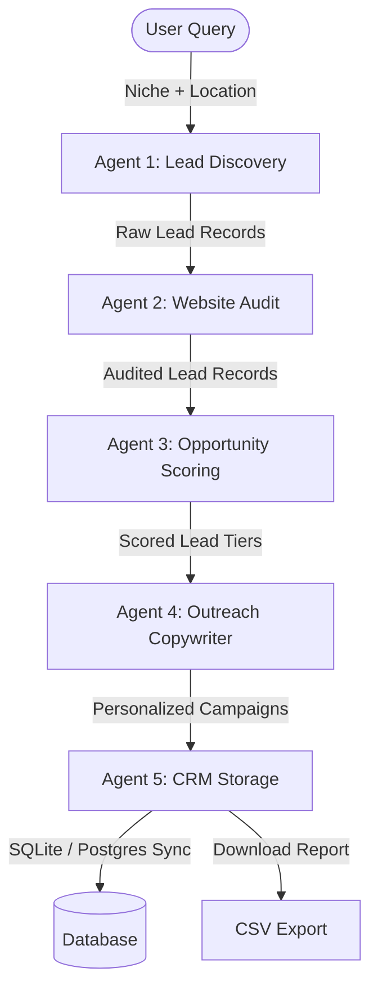

# Agentic Growth OS

> **Systems That Scale — Automatically**

**Agentic Growth OS** is a multi-agent client acquisition pipeline designed for digital agencies, B2B freelancers, and sales teams. Powered by the **NVIDIA AI Stack**, this system automates the lead discovery, presence auditing, opportunity scoring, outreach copywriting, and CRM integration process into a single-click workflow.

---

## 🛠️ Technology Architecture



### 🧠 The 5 Visual Agents
1. **Lead Discovery Agent** (Google Places API / Mock Fallback)
   - Parses niche and location queries, scraping matching business profiles including name, rating, address, and source map coordinates.
2. **Website Audit Agent** (NVIDIA NIM Mixtral 8x7B / HTML Prober)
   - Probes business websites asynchronously, checking SSL certificate setups, responsive layouts, and evaluating landing page quality.
3. **Opportunity Scoring Agent** (NVIDIA NIM LLaMA 3.1 70B)
   - Computes sales scores out of 100 points utilizing a mathematical rubric, prioritizing leads as **HOT**, **WARM**, **COLD**, or **SKIP**.
4. **Outreach Agent** (NVIDIA NIM LLaMA 3.1 70B & NeMo Guardrails)
   - Generates highly personalized B2B outreach copy for 4 channels (Email, LinkedIn, WhatsApp, Facebook) while validating compliance via safety guardrails.
5. **CRM Agent** (NVIDIA NIM E5-v5 Embeddings / SQLAlchemy)
   - Detects semantic duplicate leads using vector cosine similarity, inserts unique profiles into the CRM, and packages exports.

---

## ⚡ Setup & Installation

### Prerequisites
* **Python 3.11+** (Tested on Python 3.14)
* **Node.js v18+** (Tested on Node.js v24)
* **npm**

---

### 1. Backend Setup (FastAPI)

1. Open a terminal and navigate to the backend directory:
   ```bash
   cd backend
   ```

2. Create a virtual environment and activate it:
   ```bash
   # Windows Powershell
   python -m venv venv
   .\venv\Scripts\Activate.ps1
   
   # Windows Command Prompt
   python -m venv venv
   .\venv\Scripts\activate.bat

   # Linux/macOS
   python3 -m venv venv
   source venv/bin/activate
   ```

3. Install requirements:
   ```bash
   pip install -r requirements.txt
   ```

4. Configure your environment keys in `.env` (optional; falls back to simulated/mock engines automatically if left blank):
   ```ini
   NVIDIA_API_KEY=your_nvidia_key
   GOOGLE_PLACES_API_KEY=your_google_key
   DATABASE_URL=sqlite:///./database.db
   ```

---

### 2. Frontend Setup (Next.js)

1. Open a new terminal and navigate to the frontend directory:
   ```bash
   cd frontend
   ```

2. Install dependencies:
   ```bash
   npm install
   ```

3. Configure `.env`:
   ```ini
   NEXT_PUBLIC_API_URL=http://localhost:8000
   ```

---

## 🚀 Running the Application

To run the application locally, you will start both the FastAPI backend server and the Next.js dev server.

### Start the Backend
From the `backend` folder (ensure virtual environment is active):
```bash
python -m uvicorn app.main:app --reload --port 8000
```
* The API will be running at [http://localhost:8000](http://localhost:8000)
* Interactive Swagger Docs are available at [http://localhost:8000/docs](http://localhost:8000/docs)

### Start the Frontend
From the `frontend` folder:
```bash
npm run dev
```
* Open your browser and navigate to [http://localhost:3000](http://localhost:3000) to view the Agentic Growth OS dashboard.

---

## 🧪 Running Verification Script
You can execute the end-to-end automated verification script in the backend directory to test the 5-agent pipeline logic and SQLite database insertions programmatically:
```bash
python verify_pipeline.py
```
